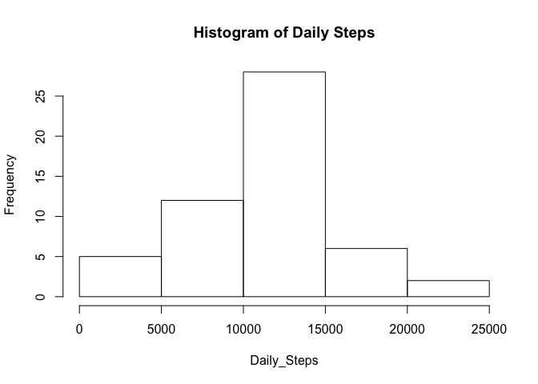
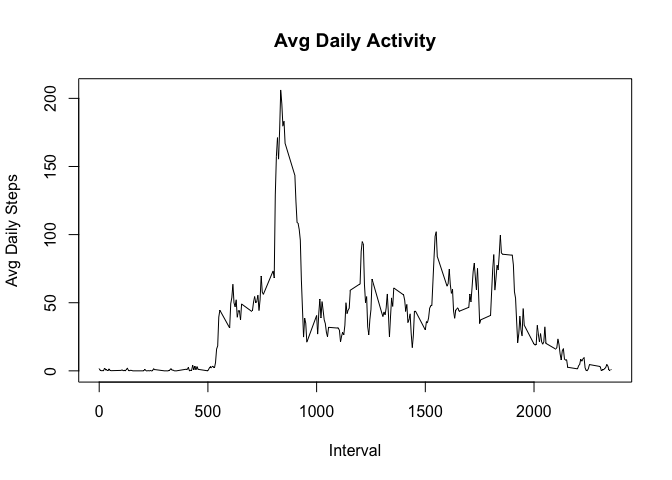
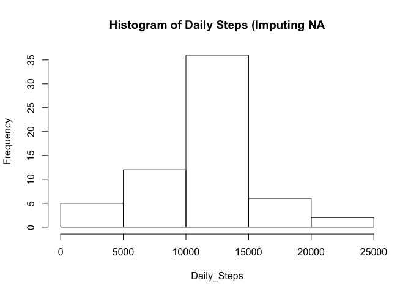
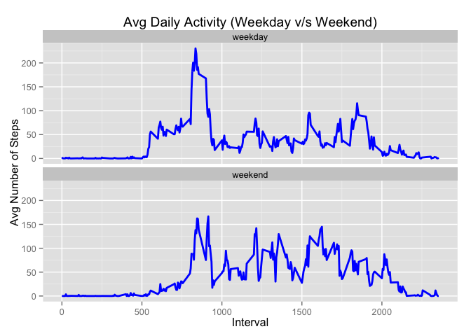

# Reproducible Research: Peer Assessment 1


## Loading and preprocessing the data

  The below code loads the libraries for ```dplyr``` and ```xtable```. Then loads the data file and converts it into dplyr dataframe.

```r
library(dplyr)
library(xtable)

data<-read.csv("activity.csv", header=TRUE, stringsAsFactors=FALSE)
data<-tbl_df(data)
```


## What is mean total number of steps taken per day?


__a__. Filter out NA values in the steps.

```r
cleanDF<-filter(data, !is.na(steps))
```

__b__. Calculate the total steps grouped by Date.

```r
DailySumdf<-cleanDF %>% group_by(date) %>% summarize(TotalSteps=sum(steps))
```

__c__. Plot the Histogram of total steps per day.

```r
hist(DailySumdf$TotalSteps, xlab="Daily_Steps", main="Histogram of Daily Steps")
```

 

__d__. Calculating mean and median of total steps per day 


```r
mean_median_df<-DailySumdf %>% summarize(mean_steps=mean(TotalSteps), median_steps=median(TotalSteps))

xt<-xtable(mean_median_df)
print(xt, type="html", include.rownames=FALSE)
```

<!-- html table generated in R 3.1.2 by xtable 1.7-4 package -->
<!-- Thu Mar 12 15:57:12 2015 -->
<table border=1>
<tr> <th> mean_steps </th> <th> median_steps </th>  </tr>
  <tr> <td align="right"> 10766.19 </td> <td align="right"> 10765 </td> </tr>
   </table>


## What is the average daily activity pattern?

__a__. Time series plot (i.e. type = "l") of the 5-minute interval (x-axis) and the average number of steps taken, averaged across all days (y-axis)

```r
avg_daily_pat_df<-cleanDF %>% group_by(interval) %>% summarize(mean_steps=mean(steps))

plot(avg_daily_pat_df$interval, avg_daily_pat_df$mean_steps, type="l",ylab="Avg Daily Steps", xlab="Interval", main="Avg Daily Activity")
```

 


## Imputing missing values

__a__. To compute Total rows with NA's.
   - We use the original dataset ```data```. then use  dplyr function ```filter```.


```r
naData<- filter(data, is.na(steps))
dim(naData)[1]
```

```
## [1] 2304
```
  Total Rows having NAs : ``2304``


__b__. In order to fill in missing (NA) values with some meaning full data, we'll use mean steps for each of the corresponding 5-minute interval.
   - The below code joins the original dataset (having NA's) to mean steps per Interval (```avg_daily_pat_df```).
   - Then for the NA values, updates the "steps" variable in original dataset to the "mean_steps".
   - The final output with NA's filled-in is stored in ```data2```.


```r
data2<-left_join(data, avg_daily_pat_df, by=c("interval"="interval")) %>% 
          mutate(steps=ifelse(is.na(steps), mean_steps,steps)) %>% 
          select(steps, date, interval)
```


__c__. Lets calculate the mean and median of Total Steps per day for the new dataset.


```r
DailySumdf2<-data2 %>% group_by(date) %>% summarize(TotalSteps=sum(steps))

mean_median_df2<-DailySumdf2 %>% summarize(mean_steps=mean(TotalSteps), median_steps=median(TotalSteps))

xt<-xtable(mean_median_df2)
print(xt, type="html", include.rownames=FALSE)
```

<!-- html table generated in R 3.1.2 by xtable 1.7-4 package -->
<!-- Thu Mar 12 15:57:12 2015 -->
<table border=1>
<tr> <th> mean_steps </th> <th> median_steps </th>  </tr>
  <tr> <td align="right"> 10766.19 </td> <td align="right"> 10766.19 </td> </tr>
   </table>


__d__. Histogram


```r
hist(DailySumdf2$TotalSteps, xlab="Daily_Steps", main="Histogram of Daily Steps (Imputing NA")
```

 

The mean and median from previous analysis isnt much different from the mean and median after imputing the NA values.


## Are there differences in activity patterns between weekdays and weekends?

  - To generate the plot we add another variable to the ```data2``` dataset ```wkday``` to indicate weekday or weekend.
  - Based on the below plot we can conclude that there is significant difference in activity levels between weekday and weekend.


```r
library(lubridate)
data2<-mutate(data2, wkday=ifelse(wday(ymd(date))==7 | wday(ymd(date))==1, "weekend","weekday"))
avg_daily_pat_df2<-data2 %>% group_by(interval, wkday) %>% summarize(mean_steps=mean(steps))

library(ggplot2)
g<-ggplot(avg_daily_pat_df2, aes(interval,mean_steps)) + 
    geom_line(colour="blue",size=1) + 
    facet_wrap(~wkday, ncol=1) + 
    labs(title="Avg Daily Activity (Weekday v/s Weekend)", x="Interval", y="Avg Number of Steps")
print(g)
```

 
